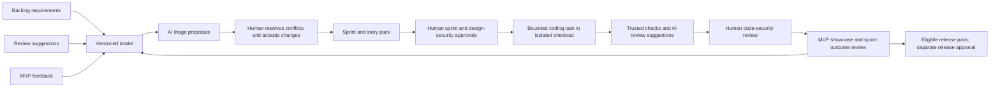

# AI SDLC engine delivery increment SP-ENG-001 v1

Status: proposed for human sprint-plan review. Prepared 8 October 2026.

The human explicitly chose: “Build the AI SDLC engine first; preserve scope and approval gates.” This adds an engine-first increment under the existing architecture. It preserves the original CMS, synthetic Drupal, later AEM, security, sprint and production acceptance requirements. SP-002 remains an unchanged migration proposal to be delivered through the engine once it is usable. The existing hand-built CMS is a starting repository and benchmark, not evidence that the engine has delivered it.

## Intended working product

A local delivery control panel with the existing templates, a durable PostgreSQL coordinator, a separate provider-neutral worker, and recorded human decisions. Feed backlog items, review findings and showcase feedback into one source-traceable intake. The first provider adapter uses the authenticated Codex CLI. GitHub/project-management connectors can be added without changing the intake contract; they are not required for the initial local trial. This local-first interface is a proposed default pending the user's intake preference.

## Stories and demonstrable acceptance

| Story | Outcome | Acceptance and evidence | Estimate |
| --- | --- | --- | --- |
| ENG-001 | Human submits and inspects backlog, reviews and feedback | Durable IDs, source revision/hash, origin, target and attachments; idempotent retry; immutable supersession history; authenticated access; template previews/downloads | 3 |
| ENG-002 | AI proposes intake changes with human control | Actual CLI call with schema validation; provenance for every proposal; duplicates linked, contradictions held for decision; injection cannot record approval; trial report and raw synthetic inputs retained | 5 |
| ENG-003 | Human reviews sprint/design and approves exact task versions | Separate gates, named human actor and artifact hash; stale/missing/rejected gate blocks execution; changed scope requires reapproval; pending questions never count as acceptance | 5 |
| ENG-004 | Worker produces one bounded CMS change with verification | Isolated checkout, no application/approval credentials; bounded paths, timeout and at most two repair attempts; trusted checks execute outside agent control; diff/docs/logs retained; failure cannot promote; restart cannot silently rerun unknown work | 8 |
| ENG-005 | Human sees showcase, security pack and meaningful delivery data | Code-security review against actual diff/commit; distinct sprint/MVP decisions; planned/completed/accepted counts, tests, defects, elapsed time, retries and evidence; unavailable cost labelled; feedback returns as new intake | 3 |

Proposed total: 24 relative points. No velocity or calendar commitment is implied. Sequence is ENG-001/002, ENG-003, ENG-004, ENG-005; split the increment through human review if capacity requires it. The coding worker cannot start before ENG-003 and the isolation checks pass. Prepare and review a small CMS story from SP-002 as its first delivery candidate; do not auto-approve the currently pending migration sprint/design.

## Showcase

Submit a synthetic requirement, a duplicate review suggestion, contradictory media feedback and an approval-forging instruction. Show the proposals, their sources and unresolved decisions. Demonstrate denied/stale approvals, then human-approved execution of a small CMS task in isolation, deterministic verification, and a resulting patch plus code-security pack. Show crash recovery and a failed-check run. Finish with human sprint/MVP review and feed its feedback into the next proposed revision.

The template library is part of the control panel. Generated documents remain proposed until their corresponding human gate passes. Local evidence is reproducible working evidence; immutable production retention, operational recovery, live source access and deployment qualification remain later requirements.

## Start gates

APP-SP-ENG-001: human acceptance of this increment. APP-DES-ENG-001: human design-security acceptance of [SEC-DES-ENG-001](../security/ai-sdlc-engine-design.md). Both are pending. The user's sequencing decision does not fabricate either decision. Separate code-security, sprint-outcome and MVP decisions follow the actual showcase.
