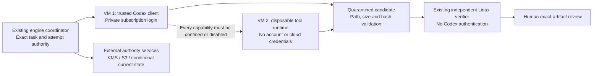

# Private worker hosting proposal

Prepared 10 October 2026 following the user's confirmation that no private worker
exists. This is a costed proposal, not authorization to purchase or provision.
It supports NB-003 without changing the accepted build/design documents.

## Recommendation and options

Prefer AWS Lightsail in Sydney for the eventual trial because recovery storage,
signing and current-authority services can remain with one provider. Start with a
48-hour isolation feasibility stage, then extend to seven days only if it passes.
DigitalOcean is a credible alternative with a directly published hourly rate.
Neither choice fixes the outstanding Codex tool boundary by itself.

| Option | Two Linux machines | Published compute price, before tax | Tradeoff |
| --- | --- | --- | --- |
| AWS Lightsail | Each 4 GB RAM, 2 vCPU, 80 GB SSD, public IPv4 | USD48/month combined | Preferred service consolidation; exact regional hourly checkout quote still required |
| DigitalOcean Basic Regular | Each 4 GiB RAM, 2 vCPU, 80 GiB SSD | USD48/month combined; USD0.07142/hour combined | Simple short trial pricing; using the proposed AWS recovery services adds a second account/provider |

Sources: [Lightsail pricing](https://aws.amazon.com/lightsail/pricing/),
[DigitalOcean pricing](https://www.digitalocean.com/pricing/droplets).
These are shared CPU starting sizes, not benchmarked capacity guarantees. Choose
an available region close to the operator; validate Sydney availability at checkout.
Do not assume headline transfer allowances apply unchanged in every region.
Public IPv4 is a billing bundle, not permission to expose services publicly:
restrict administration to the operator and service traffic to authenticated peers.

## What runs where

VM 1 holds only the supported private Codex login and trusted adapter code. VM 2
gets synthetic source and narrow operation messages; it receives no home mount,
auth file, repository write token, cloud credentials, host socket or database.
Use disposable Linux containers inside VM 2 with resource and network restrictions.
Reject untrusted callbacks into VM 1 and export only bounded validated bytes.

All built-in filesystem, patch, shell, image, browser, plugin and connected-tool
paths must be disabled or demonstrably confined outside the credential boundary.
Remote shell routing and rejecting events after execution are insufficient.
The installed client has not yet demonstrated this capability. If it cannot,
stop this adapter route and present the finding; buying a larger server will not
resolve it. See the [isolation finding](../reviews/codex-isolation-feasibility.md).

The existing public CI verifier may handle synthetic candidates without personal
authentication. Check its actual allowance before scheduling; no new CI charge is
assumed approved. Protected checks and signing must remain inaccessible to candidate
code. Extra dedicated verifier compute would add another VM and requires re-costing.

Personal account authentication must stay out of this public repository's CI.
Use a fresh supported interactive login on the private trusted client, not a copied
workstation auth file. The [official non-interactive documentation](https://learn.chatgpt.com/docs/non-interactive-mode)
restricts saved user-account CI authentication for public/open-source repositories.
Subscription-only use, no additional API charges, and one initial attempt plus at
most two repairs remain the user's selected model boundary. Hosting is a separate,
currently unapproved expense; rate limits or lack of quota stop the trial.

## Cost worksheet

All amounts below are USD before tax, foreign exchange and card fees. No promotional
credits, free tier or prepaid discount is assumed. Labour is excluded.

| Item | Monthly planning amount | Basis |
| --- | ---: | --- |
| Two 4 GB Linux machines | 48.00 | Published monthly prices above |
| Two KMS signing keys | 2.00 | USD1/key/month; request charges separate |
| Small evidence storage, requests and transfer | 5.00 | Engineering allowance, not a regional storage quote |
| Conditional authority state, signing requests and logs | 5.00 | Engineering allowance, not a service quote |
| Total ongoing planning budget | **60.00** | Single synthetic task at a time; low request/storage volume |

[KMS pricing](https://aws.amazon.com/kms/pricing/) supports the key storage line.
[S3 pricing](https://aws.amazon.com/s3/pricing/) must be checked for selected region
and measured usage. The USD10 allowances are estimates; they are not hard caps.

For DigitalOcean, 48 hours costs `2 * 0.03571 * 48 = 3.42816` compute;
seven days costs `2 * 0.03571 * 168 = 11.99856` compute. Proposed planning budgets
are **USD10 for the first 48 hours** and **USD25 total for seven days**, including
small service usage and contingency. Seven days includes the first 48 hours.
For Lightsail, `48 * 7 / 30 = 11.20` is only an illustrative monthly proration,
not the vendor's hourly quote. Confirm its actual hourly rate before approving the
same short-trial budget. Ongoing USD60/month is an alternative continuation estimate,
not an additional charge on top of a full month's compute already billed.

Excludes production hosting/database, load balancer, NAT gateway, managed private
network access, backups/snapshots beyond bundled disks, premium support and large
egress. None is required by this proposal. If any becomes necessary, revise the
quote before provisioning. Retained evidence and keys may continue billing after
VM deletion. An 8 GB upgrade or paid CI use also requires a revised estimate.

## Recovery services and remaining engineering

Propose separate KMS keys for supervisor/recovery and verifier identities, subject
to accepted trust-role requirements. AWS now documents Ed25519 support, including
RAW versus prehashed signing modes; verify existing domain-separated bytes and Node
signature verification against the selected mode before adoption.
[KMS key specification](https://docs.aws.amazon.com/kms/latest/developerguide/symm-asymm-choose-key-spec.html).

Use versioned S3 evidence with reviewed Object Lock retention, plus a separate
conditionally updated current-authority record (DynamoDB is a candidate). Immutable
objects alone cannot determine which supervisor is current. Implement and qualify
monotonic epochs, conditional replacement, revocation, old-restore rejection and
host-loss recovery before calling that authority complete.
[Object Lock](https://docs.aws.amazon.com/AmazonS3/latest/userguide/object-lock.html),
[conditional writes](https://docs.aws.amazon.com/amazondynamodb/latest/developerguide/Expressions.ConditionExpressions.html).

Keep cloud signing/state access in trusted components, outside generated code.
Provisioning design must resolve scoped short-lived service identity explicitly;
this proposal does not assume Lightsail automatically supplies an EC2 instance
role. If secure identity needs a different compute service, re-cost before purchase.
Agree evidence retention before enabling locks because protected objects can outlive
the trial and incur continuing charges.

## Staged execution and exit criteria

1. Before spending: review provider/account ownership, hourly quote, cloud budget,
   retention and private access design. Prepare the exact CLI capability inventory
   and supported routing/disable configuration. If no viable complete boundary is
   identified, stop without provisioning.
2. After explicit hosting authorization: create only the two scoped machines for
   up to 48 hours. Use synthetic canaries first, without subscription authentication.
   Prove capability confinement, network/path escapes, cancellation of descendants
   and pending-operation drain. Record exact versions and configuration.
3. Only after isolation passes: supported private login, durable intent/attempt
   accounting, authoritative task binding and external recovery qualification.
   A seven-day extension stays within the proposed total budget and requires the
   approved scope. Uncertainty quarantines the attempt and prevents overlap/retry.
4. Run one approved synthetic task under existing human gates, initial attempt plus
   at most two repairs. Verify independently and present the exact artifact for
   review. No autonomous promotion, merge or production deployment.
5. At deadline or failed qualification: revoke login and narrow service access,
   delete trial compute and unnecessary disks/IPs/snapshots, inventory retained
   locked evidence/keys, and check billing. Stopping a VM is not the teardown plan.

Use operator-visible billing alerts and deadline cleanup, with a trusted external
owner able to terminate resources even if a worker fails. Alerts can lag and do not
guarantee a hard spending ceiling; monitor actual usage and delete resources early
enough to allow for billing delay.
[AWS Budgets](https://docs.aws.amazon.com/cost-management/latest/userguide/budgets-managing-costs.html).

## Decision ready for review

Recommended choice: AWS Lightsail, conditional on the verified hourly quote and
identity/tool-boundary design, with USD10/48-hour feasibility and USD25 total/seven-day
trial planning budgets. DigitalOcean is the alternative with explicit hourly math.
The owner must authorize the provider, account and hosting expense before purchase.
No resources were provisioned, model calls made or execution/retry flags enabled by
this proposal. The local application remains stopped.
