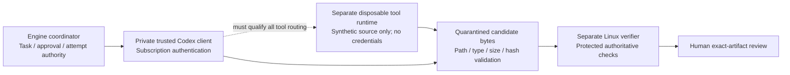

# Codex subscription adapter: isolation feasibility finding

This is a design finding under NB-003, not a completed executor qualification or a
change to the accepted plan. Codex and the subscription-only/no-additional-charge
boundary remain selected. No additional attempt or provider selection is requested.

## Concrete finding

Installed Codex 0.155.1 rejects `codex exec --tools none --help` with an unexpected
argument error before inference. The generated ThreadStartParams schema contains
generic config, dynamicTools, sandbox, permissions and environment settings, but no
explicit built-in-tool allowlist property. A strict-config probe through features
list was inconclusive because that subcommand does not support strict-config.
Do not cite that probe as rejection of the tool_choice configuration key.

The official configuration reference documents individual controls, including
shell_tool, apps and hooks. It does not establish a complete tool-free invocation
for this inspected configuration. Neither absence from help/schema nor this review
proves that a broader product capability is impossible. The result is narrower:
we have not demonstrated a complete pre-execution boundary for the current local
client. An empty dynamicTools list must not be assumed to remove built-in tools.

The existing transport guard detects tool-bearing events after they arrive.
It cannot prevent effects, and root-process cancellation cannot establish descendant
termination. The adapter must remain closed rather than equate those checks with
isolation. Observations are retained in `docs/evidence/codex-isolation-feasibility/audit.json`.

## Concrete private-worker proposal

Keep the chosen Codex subscription and authenticate using the supported interactive
login on a dedicated, private Linux worker. Do not copy the workstation's auth file
or send it through this public repository's CI. No worker/account is provisioned by
this proposal, and no purchase, feature installation or deployment occurs.

Proposed separation:

This is an architecture target, not an existing deployment. A dedicated VM alone
does NOT separate credentials from tools: if tools execute as the client's user,
they may still access its auth. Qualification must show that every enabled code,
filesystem, patch, image, browser or connected-tool path is disabled or confined to
the separate runtime. Remote shell routing alone is insufficient. If the installed
client cannot support that arrangement, report the adapter infeasible under the
current design and present a reviewed alternative; do not weaken the boundary.

Required worker properties and verification before any real task:

1. Private operator-owned Linux environment with no platform database, repository
   write token, host secrets or personal home mounted into generated-code tools.
2. Fresh supported Codex login local to the trusted client; no personal auth in
   public CI, tool environment, journal or evidence. Verify subscription-only
   operation without paid credential/provider fallback or credit purchase.
3. Tool-runtime separation enforced outside model instructions. Probe each actual
   capability using synthetic credential/host canaries, path escapes and network
   attempts; retain the exact version/configuration evidence.
4. Trusted owner of all operation clients and descendant processes. Demonstrate
   cancellation and pending-operation drain; uncertainty quarantines the attempt
   and prohibits overlap/retry. Integrate durable intent/fencing and attempt count.
5. Only validated synthetic candidate bytes leave the worker for independent
   verification. A successful patch then needs the existing exact-task and human
   code-security/outcome/MVP gates.

## Next action and dependency

Identify an existing private Linux worker/account, or choose where the proposed
worker should be provisioned. Its identity, isolation capabilities and operational
owner determine the concrete deployment design. Account credentials must not be
sent in chat. Until a target exists, infrastructure-dependent qualification cannot
be honestly completed on the current workstation or public account-auth CI path.

Independent recovery/signing services also remain unprovisioned. This finding does
not mark host-loss recovery complete or enable any engine execution/retry flag.
Local app remains stopped, PostgreSQL data is preserved, and the previously rejected
app startup was not retried.

## Sources checked with OpenAI Docs, 10 October 2026

- [Configuration reference](https://learn.chatgpt.com/docs/config-file/config-reference)
- [Non-interactive mode](https://learn.chatgpt.com/docs/non-interactive-mode)
- [Permissions](https://learn.chatgpt.com/docs/permissions)

The public-account-auth CI limitation was established in the prior authentication
checkpoint. This review makes no claim about untested versions or account-specific
availability. It changes documentation/evidence only, so no runtime regression
suite or paid model call is needed.
